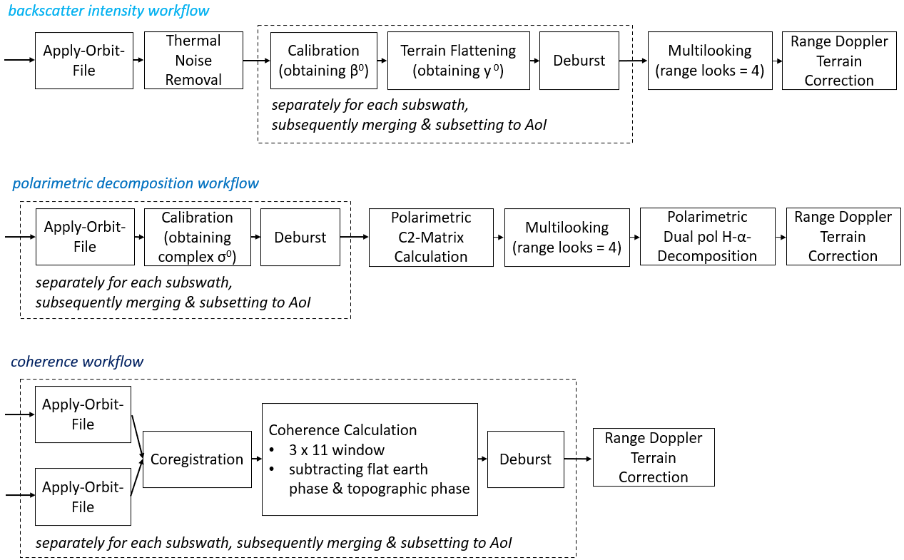

## SAR-based parcel analyses

Synthetic Aperture Radar (SAR) can be used for a variety of interesting applications in the field of remote sensing. Some of the most common SAR-based features comprise the backscatter intensity, polarimetric decomposition parameters and coherence values. Different to achievements in the field of optical data (e.g. Sentinel-2), provisions of ready-to-use data products containing these features are still rare. Apart from backscatter intensities, most of the other features are not provided in cloud-based data cube environments (such as GEE) yet. This repo therefore contains some basic scripts calling the SNAP python interface (snappy) to create these products in an automated manner for a set of downloaded Sentinel-1 scenes and a given AoI.

The scripts for processing are organised as follows:

* `distribution_s1.Rmd`-> exploratory analyses on the spatial distribution of S1 scenes
* `download_preprocessing.ipynb` -> downloading S1 scenes for a given AoI using ASF API  
* `snap_preprocessing.ipynb` -> bundling calls to underlying .py scripts
* `intensity_processing.py` -> calculating gamma0 backscatter intensities (based on 1 SLC scene
* `polarimetry_processing.py` -> performing dual pol H-a-decomposition (based on 1 SLC scene)   
* `coherence_processing.py` -> calculating coherence values (based on 2 SLC scenes) 

Note that the python scripts are designed to be used on there own. The notebook just builds a wrapper around these single scripts. Also note that the python scripts were tested only for the use case presented below. They are designed to work for AoIs covering single or multiple subswaths. For AoIs covering multiple scene tiles, adjustments would be necessary. All scripts were run on a 8 core machine with 32 GB RAM. To give an indication on the performance of the snappy scripts the following processing times were achieved for the AoI below (~65km2):

*  intensity processing chain: 3.5 min/scene (partly due to terrain flattening)
*  polarimetry processing chain: 0.5 min/scene 
*  coherence processing chain: 1.2 min/pair of scenes
 

 

The above-mentioned scripts are working on their own and can be used for different purposes. However, they were created and primarily used in the context of field-based analyses (phenology and crop classification). Thus, alongside with the above-mentioned scripts there is a script called `field_analyses.ipynb` which relies on the pre-processed data and performs subsequent analyses by creating time-series curves and performing classifications using the random forest classifier. 

